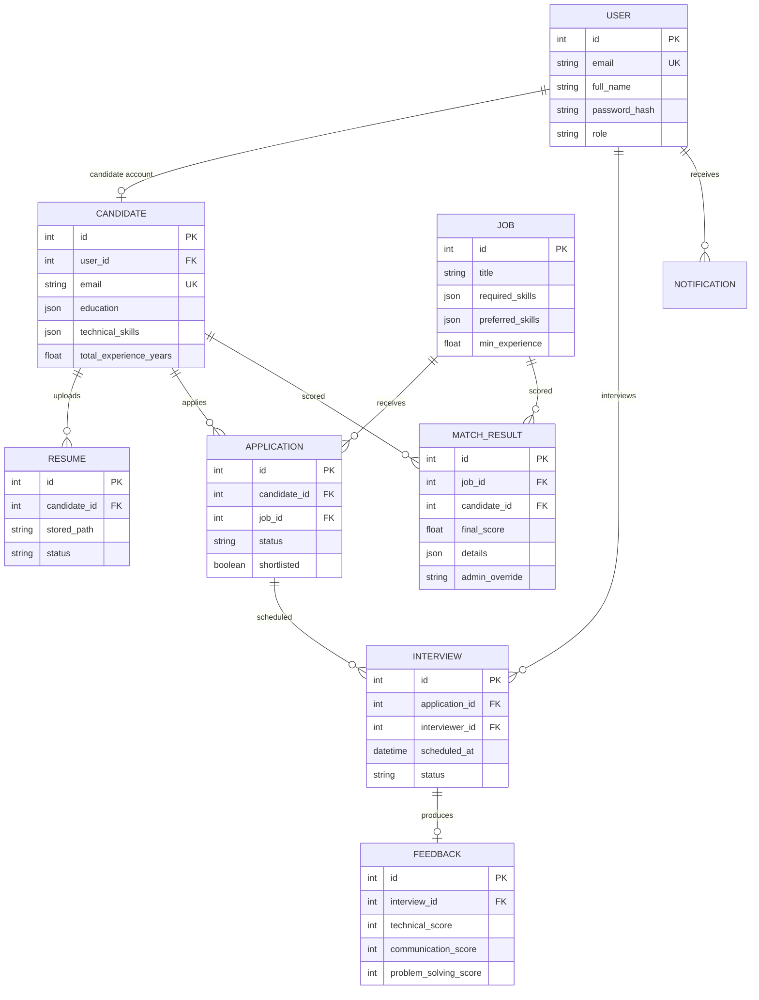

# Database ER Diagram

```mermaid
erDiagram
  USER ||--o| CANDIDATE : "candidate account"
  CANDIDATE ||--o{ RESUME : "uploads"
  CANDIDATE ||--o{ APPLICATION : "applies"
  JOB ||--o{ APPLICATION : "receives"
  JOB ||--o{ MATCH_RESULT : "scored"
  CANDIDATE ||--o{ MATCH_RESULT : "scored"
  APPLICATION ||--o{ INTERVIEW : "scheduled"
  USER ||--o{ INTERVIEW : "interviews"
  INTERVIEW ||--o| FEEDBACK : "produces"
  USER ||--o{ NOTIFICATION : "receives"

  USER {
    int id PK
    string email UK
    string full_name
    string password_hash
    string role
  }
  CANDIDATE {
    int id PK
    int user_id FK
    string email UK
    json education
    json technical_skills
    float total_experience_years
  }
  RESUME {
    int id PK
    int candidate_id FK
    string stored_path
    string status
  }
  JOB {
    int id PK
    string title
    json required_skills
    json preferred_skills
    float min_experience
  }
  APPLICATION {
    int id PK
    int candidate_id FK
    int job_id FK
    string status
    boolean shortlisted
  }
  MATCH_RESULT {
    int id PK
    int job_id FK
    int candidate_id FK
    float final_score
    json details
    string admin_override
  }
  INTERVIEW {
    int id PK
    int application_id FK
    int interviewer_id FK
    datetime scheduled_at
    string status
  }
  FEEDBACK {
    int id PK
    int interview_id FK
    int technical_score
    int communication_score
    int problem_solving_score
  }
```
